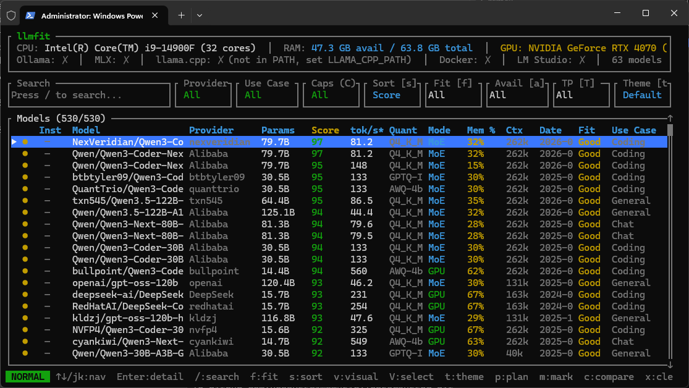

# TensorBuster: Where MCP and C2 frameworks collide
During red team operations, the days of getting past security solutions using Cobalt Strike and nothing else are over. In order to get past real-time monitoring, one needs to design a C2 framework that's not only polymorphic but also, critically, nondeterministic. Legacy polymorphism like that of Sliver may get you past traditional AV solutions, but the only way to get past modern EDRs like CrowdStrike Falcon or Palo Alto XDR on a consistent basis is to get creative, especially with the implementation of AI by the EDR solutions themselves.

While going through the COAE course, the combination of tensor steganography in the `AI Data Attacks` module and MCP in the `Attacking AI: Application and System` module gave me an idea: What if it's possible to use MCP as a C2 connection, LLMs as the implants, and tensor steganography as a C2 stager? The implications of this are profound, since the end result is something that is both polymorphic AND non-deterministic from the get-go.

TensorBuster is the result of this experiment. It's an atttempt to build a complete C2 framework specifically for the age of AI, where tensor steganography is used to hide one LLM inside another and/or to hide an LLM inside image tensors, using a base model (`NexVeridian/Qwen3-Coder-Next-8bit`) that was hand-picked from this `llmfit` output to ensure compatibility with those who have hardware similar to my MSI Aegis R2 rig:

The result is, at least in theory, a C2 framework whose implants can be controlled using plain English and can express complete and total polymorphism to avoid detection

## WARNING: FOR AUTHORIZED USE ONLY
This tool is intended solely for use ONLY in the following contexts:
* During an authorized red team operation
* During an authorized internal penetration test of a production network
* In a bug bounty program where aggressive WAFs like Cloudflare Firewall are present (particularly common in programs hosted on HackerOne, Bugcrowd, and the like)
* In a realistic CTF or lab environment where lateral movement is necessary to make any progress

I take absolutely no legal responsibility for the misuse of this software against any target that you lack written authorization to test. Responsibility is squarely on the user to ensure that this C2 framework is used legally, ethically, and responsibly.

## WARNING: UNTESTED
Because I have yet to be offered a real-world engagement that would allow proper testing of this beast and isn't HTB-confidential stuff, I currently do not have the system resources to adequately test this. As such, those with access to more than one powerful machine capable of running powerful LLMs is going to need to test this on either a production network, a large room with many physical machines in it, or an AI lab environment that isn't as closed off as HTB's.

PRs and issue reports are welcome! If during testing any issues are discovered, feel free to report them and I'll look into it.

## What's implemented
* MCP core
* Pivoting (via the `mcp_pivot` tool, which LLMs can use to spin up clones of the original MCP server to cross subnet boundaries)
* Tensor steganography (via the `encode_lsb`, `decode_lsb`, `encode_lsb_from_image`, `payload_enc`, `export_encoded`, and `import_image` MCP tools)
* Exfiltration (via the `load_file` and `drop_file` tools)
* Command execution (via the `run_system_command` tool)
* On-the-fly payload generation/compilation (via the `build_windows_payload` tool; still needs major testing)
* Dynamic listener port allocation using `random.randint()` to make fingerprinting more difficult
* MCP-based staging (via the `stage_encoded` tool, which uses tensor steganography to hide an encoded MCP client inside a model and export the resulting modified model data)

## What still needs work
* Beaconing / sleep obfuscation
* In-memory LLM loading on target systems (this is going to require the use of a client written in a compiled language [like](https://github.com/rust-mcp-stack/rust-mcp-sdk) [Rust](https://github.com/huggingface/huggingface_hub_rust) to get around the lack of a Python interpreter on most real-world targets)
* `llmfit` as a plugin, to autodetect model compatibility on remote systems (this will have to also involve the Rust beacon)
* GUI